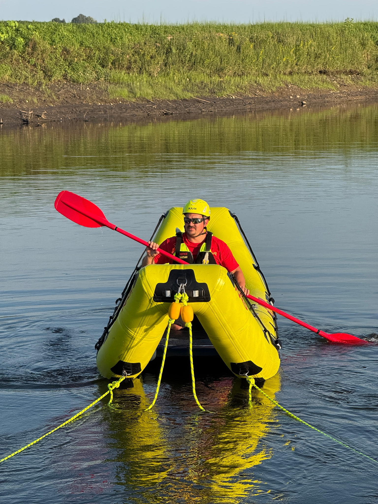
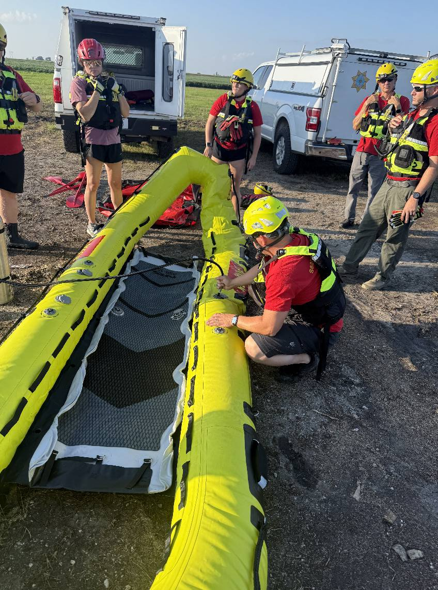

🍌 Meet the ‘Banana Boat’! 🍌

Last night, Boone County Search & Rescue spent training night working hands-on with one of our most unique tools, our bright yellow inflatable rescue raft know as the NRS ARS 155 Rescue Raft, or as it's more affectionately nicknamed the 'Banana Boat.'

 enough for two rescuers and a victim.")

It might look odd but its curved shape and open-ended design make it an ideal rescue boat. Instead of lifting a victim over the side, we can glide right up and pull them straight onto the deck. This makes it a game-changer for ice rescues, and just as valuable in flood or swiftwater scenarios where a motorized craft can’t reach.

To make sure we can use it to its fullest, we drilled real-world rescue skills:

- Shoreline Launching – Practicing inflation and deployment without a boat ramp, simulating the rough or remote access points we might encounter on a call.
- Two-Point & Four-Point Tethering – Learning to “anchor” the raft in moving water. Two points let us hold steady for quick extractions, while four points can lock us in place for longer, more complex operations.
- Hand Signal Communication – Water rescues are noisy and chaotic; hand signals ensure everyone on the team stays in sync when voices can’t carry.
- Team Maneuvering Drills – Moving the raft precisely as a crew, whether pushing into current, ferrying across, or lining up for a victim pickup.

Every repetition builds the muscle memory and teamwork we need when lives are on the line, especially in situations where speed, safety, and precision matter most.

A huge thank you to the Boone County Community Foundation Grant for making the Banana Boat possible. Your support ensures we’re ready to reach those in need — no matter the terrain, conditions, or obstacles in our way. 💛
