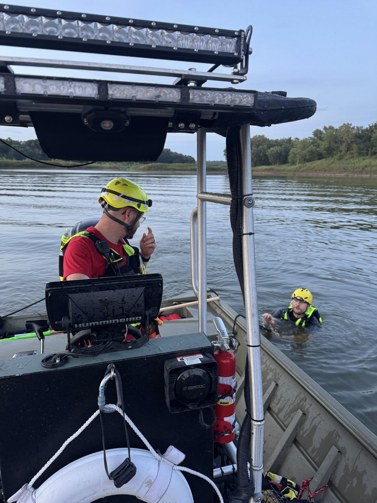
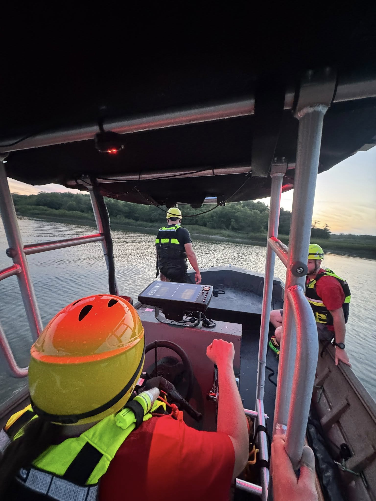

We’re a little late with this week’s update, but our crew put in some serious work during training.

- Man Overboard Drills – Practicing quick, safe recovery when someone ends up in the water.
- Boat Maneuvering – Fine-tuning control of our craft around hazards and in tight spaces.
- Catastrophic Scenario Exercise – Wrapping up with a full simulation that pushed our team to adapt in real time.

The scenario included:

- Multiple people in the water
- A malfunctioning rescue craft
- A boat taking on water, forcing crews to prioritize
- And even an uncooperative, hysterical victim

We also trained at the Madrid Gravel Pit this week. Part of our mission is to familiarize our members with lesser-known waterways and bodies of water in Boone County. This not only builds confidence in different environments, but also allows us to pre-plan for potential emergencies in those locations.

The goal? To challenge our team to stay calm, make quick decisions, and adapt to changing conditions, just like they would in a real-world emergency.

Training nights like this sharpen our skills and build the teamwork needed to handle the unpredictable.
