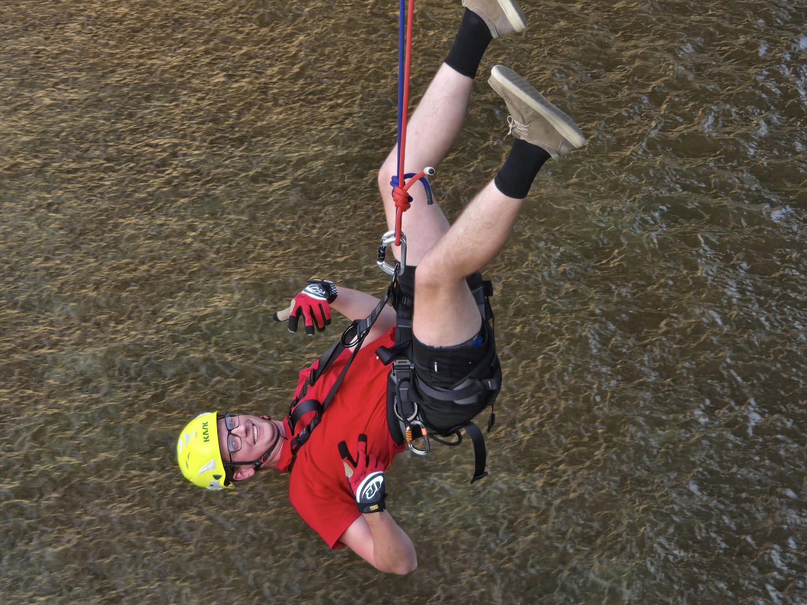
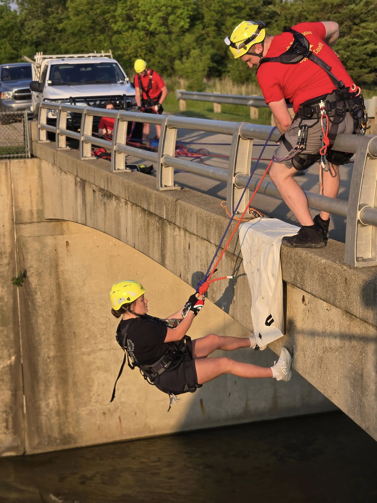

Boone County Search & Rescue members were out at Don Williams practicing edge transitioning — a critical rope rescue skill that involves moving from a stable surface (like a bridge or cliff edge) into a vertical drop.

Edge transitions are already one of the more complex moves in rope rescue. Doing them off a bridge, like the one over the Don Williams spillway, adds another level of difficulty — there’s no slope or wall to brace against. Once you’re over the rail, it’s just open air and trust in your system, your rigging, and your team.

These drills help prepare our team for real-world situations where victims may be located in hard-to-reach or dangerous locations. For many of our members this was their first chance to practice this skill. Practicing in a controlled environment and with a relatively low height like the spillway bridge allows a gentle introduction. Every rep builds skill and confidence toward technician-level certification.

We would also like to thank everyone who stopped out to see what was going on and chatted with us!
