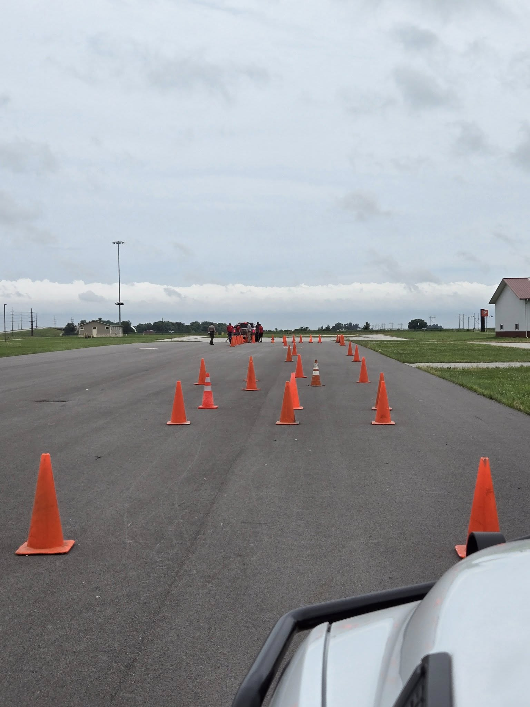

Today, our Boone County Search & Rescue team took on Emergency Vehicle Operations Course (EVOC) training at the Central Iowa Expo, thanks to the expertise of Sheriff’s Office Driving Instructor Deputy Quinn. Members practiced precision driving, backing with trailers, and defensive maneuvers to ensure we can respond quickly and safely when it matters most.

Big thanks to Deputy Quinn for sharing his knowledge! And don’t worry—only a couple of cones were harmed in the name of progress!
