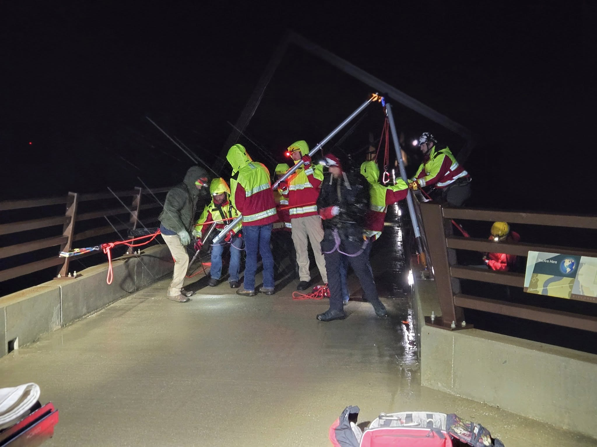

🌧 Training doesn’t stop for bad weather — it starts there. 🌧

Last night, Boone County Search & Rescue headed out into the wind and rain to run a nighttime rope-rescue scenario on the High Trestle Trail Bridge. No daylight. No comfort. Just headlamps, slick steel, and a 130-foot drop into darkness.

Our team:

- Stood up incident command in driving rain
- Lowered our first rescuer over the bridge railing into the black void below
- Built and rigged the rescue tripod to send down a stokes basket
- Executed a live rope transition from edge rigging to tripod while our rescuer was still suspended mid-air

And they did it without hesitation.

Because it takes a special kind of person to strap in, step over a railing, and trust their teammates with their life all in the name of someone they haven’t even met yet.

Rain or shine. Day or night. Our volunteers train so that when the call comes, they’re ready.
