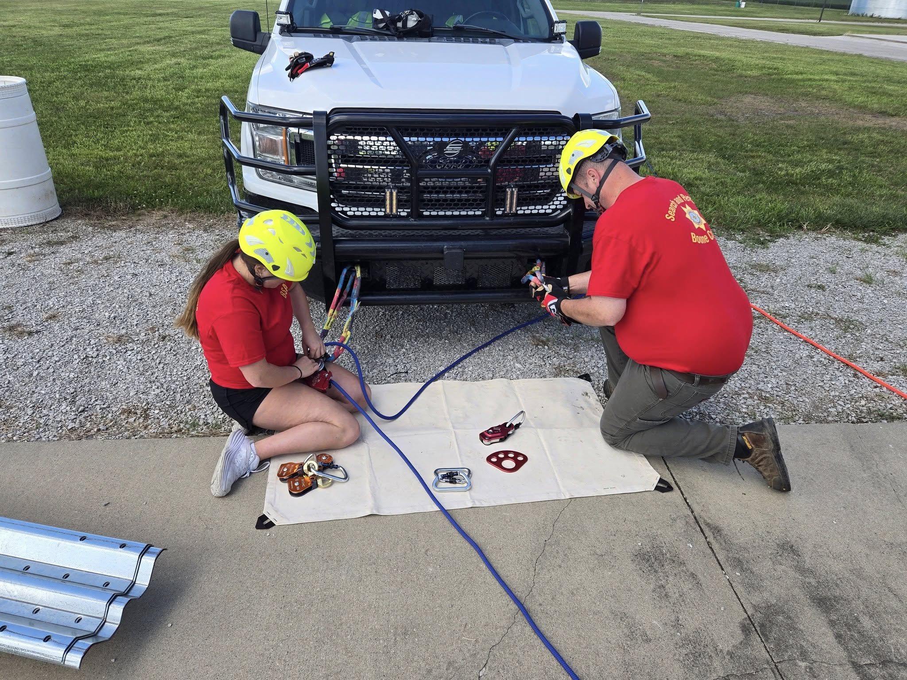
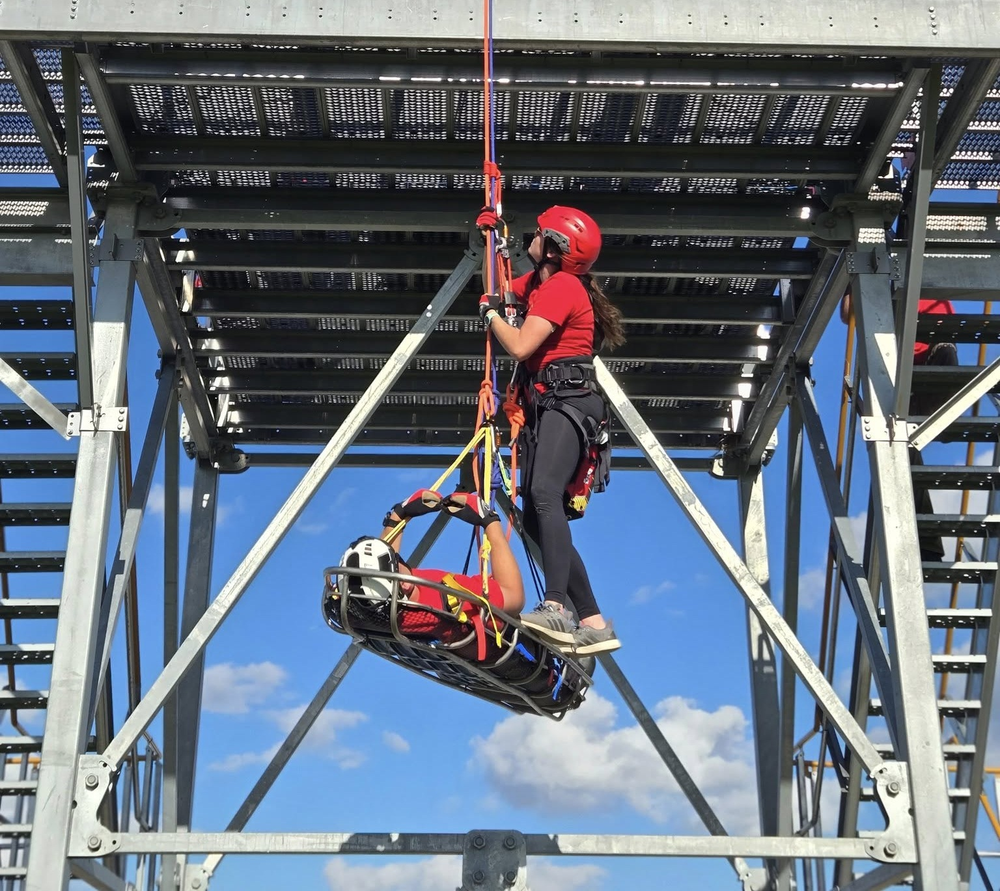
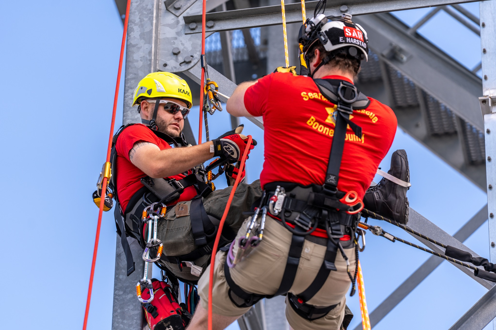
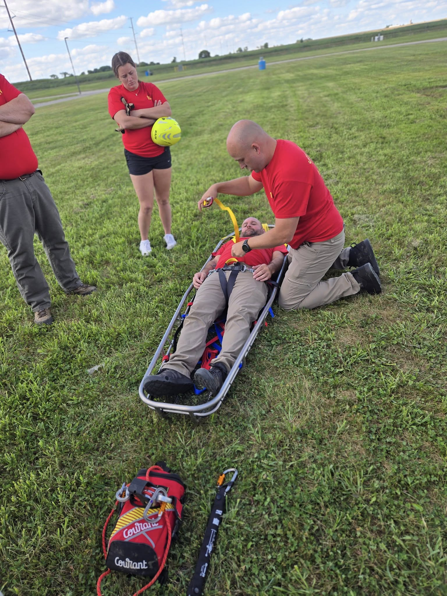
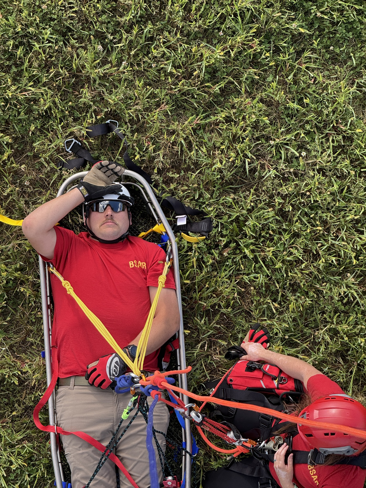

This week, Boone County Search & Rescue focused on sharpening our rope rescue capabilities — a critical skillset for emergencies in both rural and industrial settings.

Our training covered two major areas:

## Team-Based Victim Evacuation (Industrial Settings)

We worked on scenarios where a victim must be safely lowered or retrieved from structures like towers or grain bins. These high-angle rescues require precision, coordination, and trust between every team member to ensure both rescuer and patient safety.

## Individual Rope Skills & Confidence

Each rescuer practiced transitioning smoothly between ascending and descending on rope systems — a vital ability when terrain or structure changes mid-rescue. Building this confidence ensures our members can adapt quickly in real emergencies.

## High-Risk, Low-Frequency Rescue Training

Much of Search & Rescue is just that, training for incidents that don’t happen every day, but when they do, they’re some of the most dangerous situations we face. Whether it’s a tower, a grain bin, a cliff, or a steep bluff, these rescues demand technical skill and calm under pressure. That’s why we put in the hours: to make sure we’re ready when our community needs us most.

Every hour spent training means we’re more prepared to bring someone home safely when the unexpected happens.

