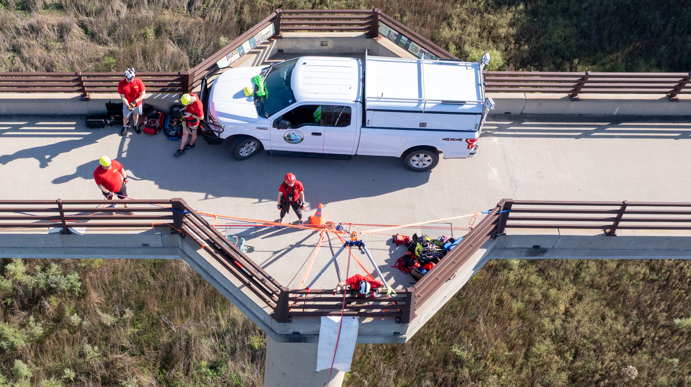
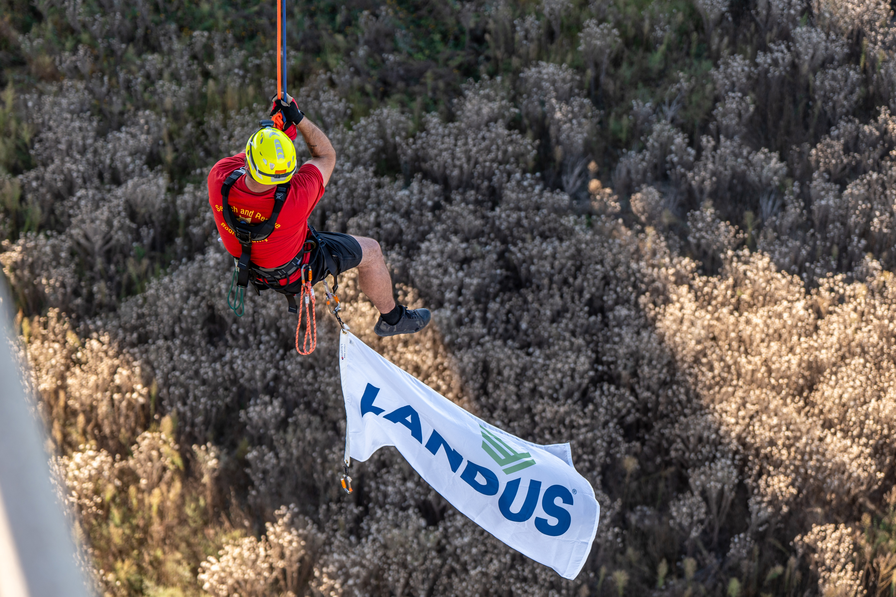

This weekend our team had the opportunity to put our new Arizona Vortex tripod into action during a rope rescue training exercise on the High Trestle Bridge.

This incredible piece of rescue equipment was purchased thanks to a generous grant from [Landus](https://www.landus.ag).
The tripod gives us the ability to create solid anchors in places where none exist, allowing us to safely raise and lower rescuers, victims, and equipment in hazardous terrain.
Beyond rope rescue, it will also expand our ability to assist with confined space rescue operations, helping us provide specialized technical rescue capabilities to support fire and rescue teams throughout Boone County.

We are grateful to [Landus](https://www.landus.ag) for their investment in local safety and community resilience. Their support directly helps us better serve Boone County and the region when emergencies happen.

A big thank you as well to everyone who stopped to watch, ask questions, and cheer us on while we trained!
👏

