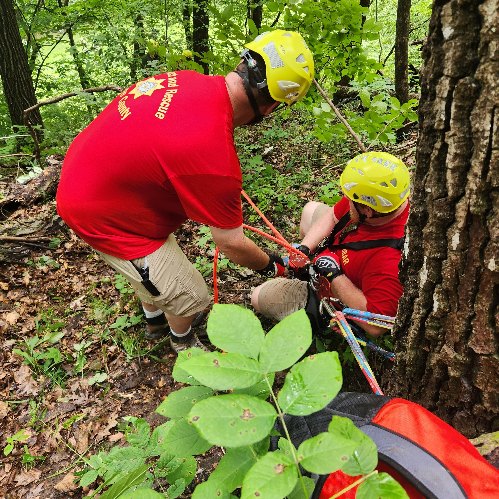
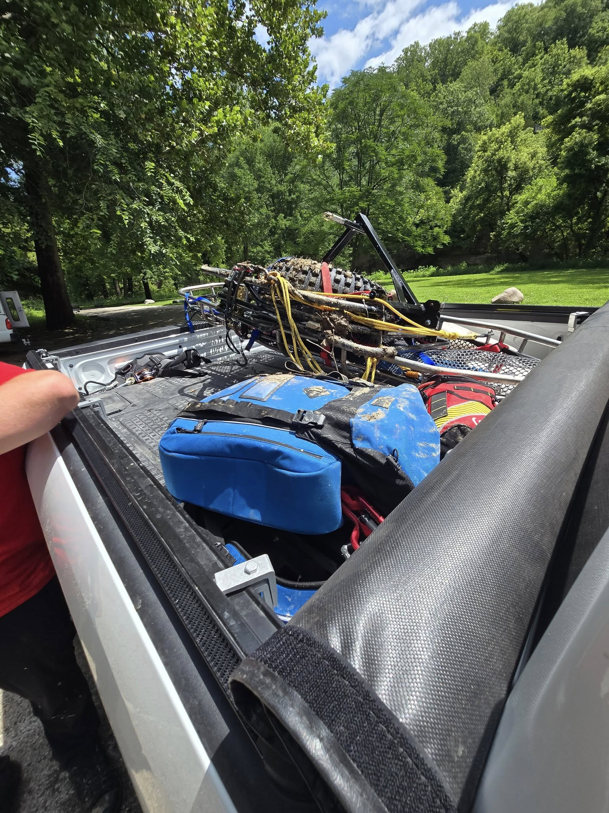

At 10:20 AM this morning, Boone County 911 received a call from a hiker reporting that his brother had fallen and likely broken his ankle while exploring the Old Indian Trail near the Crow’s Nest in Ledges State Park. The victim, a 30-year-old male, was conscious but unable to move located approximately 75 yards uphill on a muddy, root-covered slope with no established trail.

Boone County Sheriff’s Deputies and Boone Fire Department were first to respond, navigating the rugged terrain on foot after determining that vehicle access was not possible. Recent rainfall had left trails slick and muddy, and several of the park’s low-water crossings were flooded, further complicating access. After locating the injured hiker, responders determined that the steep, unstable conditions would require additional support. At 10:52 AM, Boone County Search & Rescue was officially requested to assist with a rope-based technical carry-out.

Our Rope Rescue Team responded with litter equipment, a one-wheel system, and full rope complement. We arrived on-scene at 11:15 AM and began the process of accessing the patient’s remote location. Over the next 55 minutes, crews worked through wet, unstable footing to stabilize the patient, package him, and maneuver him down the ridge to a safe lower point. At approximately 12:10 PM, the patient was successfully lowered over the sheer cliff face to the waiting Boone Fire personnel and Boone County Hospital EMS team below.

To make matters more difficult, hot and humid summer conditions placed added physical strain on all crews working in full gear during the rescue.

Agencies Involved:

- Boone County Sheriff’s Office
- Boone Fire Department
- Boone County Hospital EMS
- Boone County Search & Rescue
- Boone County Emergency Management

We’re proud to support our partner agencies and thankful for the seamless teamwork that made today’s operation a success. Today’s rescue highlighted the challenges of terrain, weather, and coordination — and once again demonstrated the value of specialized technical rescue capabilities in Boone County.

Special thanks to Ledges State Park Manager Andy Bartlett, whose assistance as a guide was invaluable in navigating the park and ensuring swift access to the scene.
