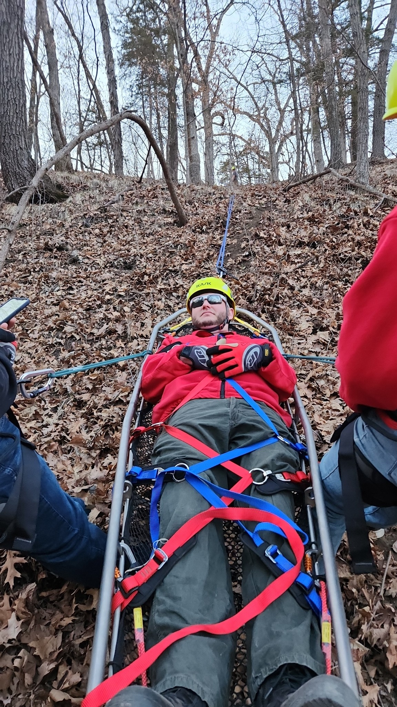

This week, Boone County Search & Rescue returned to Ledges State Park for low angle Rope Rescue Training!

Our team practiced essential Rope Rescue techniques on the park's rugged terrain, focusing on patient packaging, anchor systems, and safe haul operations. Training in realistic environments like Ledges helps prepare our Responders for real-world Rescue scenarios in difficult terrain.

We're proud of our team's continued commitment to honing their skills - rain or shine, day or night.
