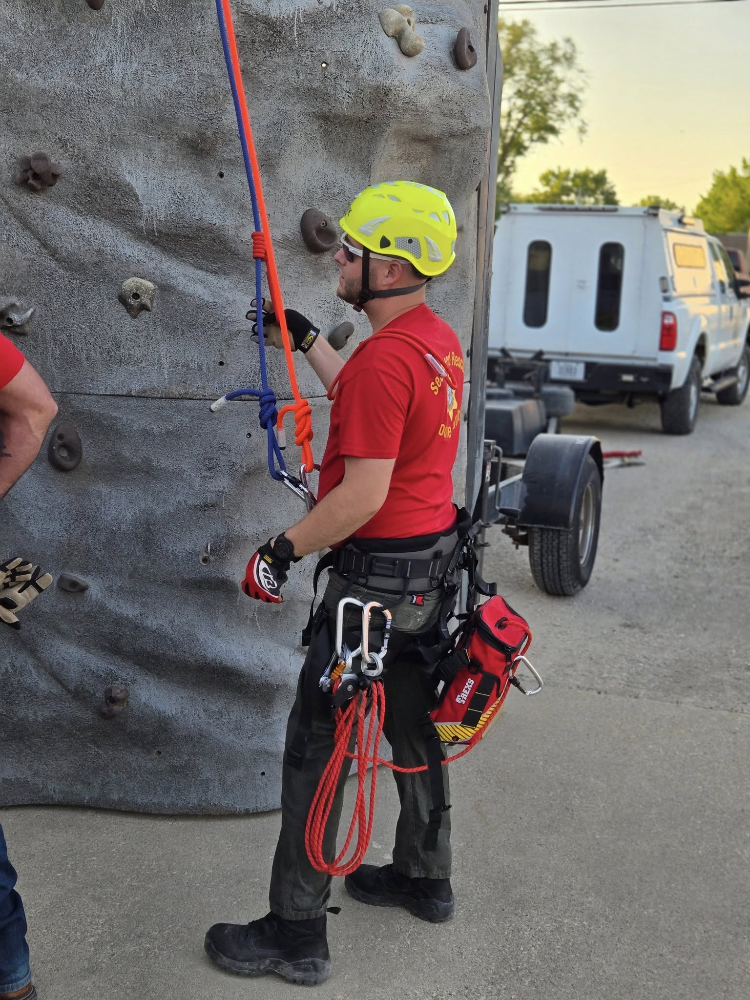
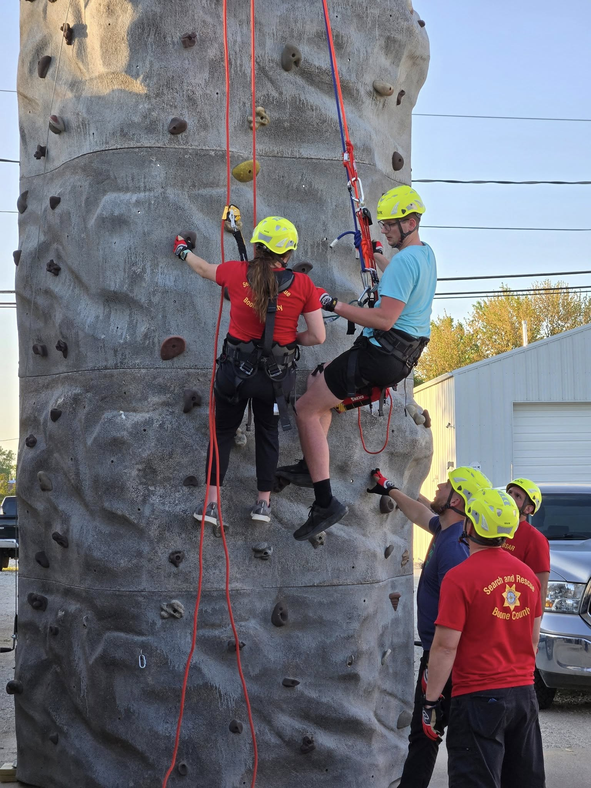

Last night, Boone County Search & Rescue members trained on our new climbing trailer, focusing on pickoff rescues—a critical rope rescue skill.

A pickoff rescue is used when someone is suspended on a rope (like from a fall or climbing incident) and unable to self-rescue. One of our rescuers descends to the victim, secures them, and safely lowers both individuals to the ground.

This high-angle scenario demands precision, teamwork, and trust—exactly what our team trains for.
Huge thanks to our volunteers for putting in the time to stay sharp. Because when the call comes in, we’re ready.
