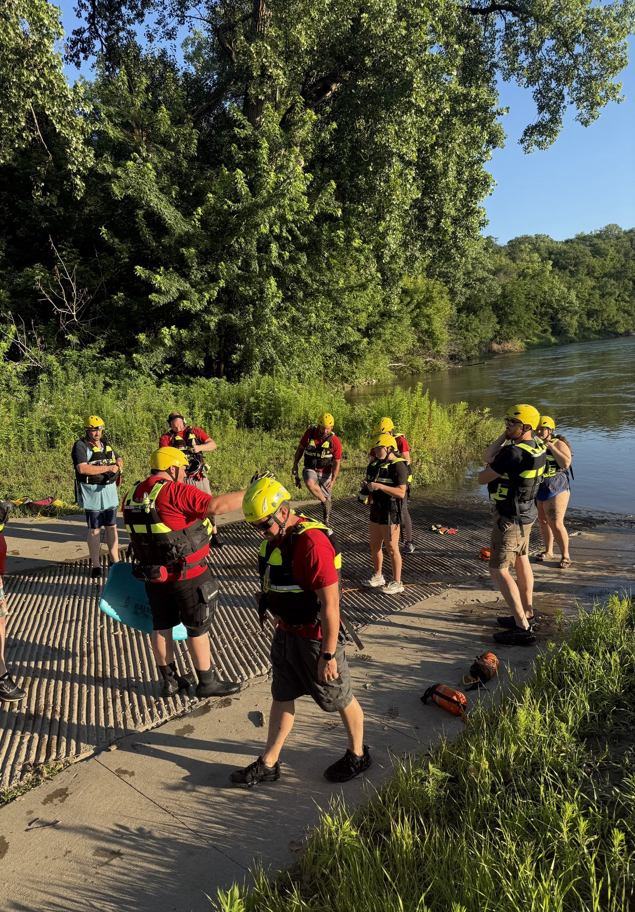
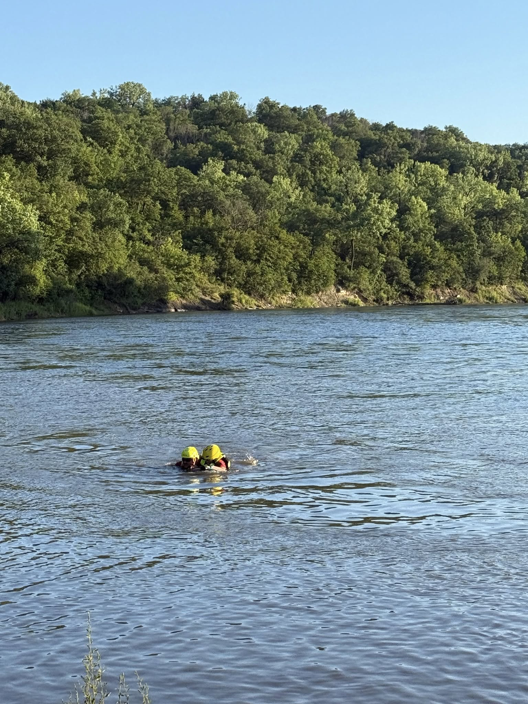

Last night, Boone County Search & Rescue held a dynamic training session focused on river rescue operations. The evening began with a classroom discussion on river dynamics, obstacles, and hazards commonly faced during swiftwater incidents. 

We then moved to the Des Moines River for hands-on live rescue swimming drills, where team members rotated between the roles of rescuer and victim. Practicing in real conditions gave our responders a chance to experience the true force of the current and refine their skills in swiftwater navigation, victim contact, and extraction.

Realistic training like this prepares us to respond effectively and safely when the call comes in. We're proud of our team's dedication and commitment to training in all conditions!
