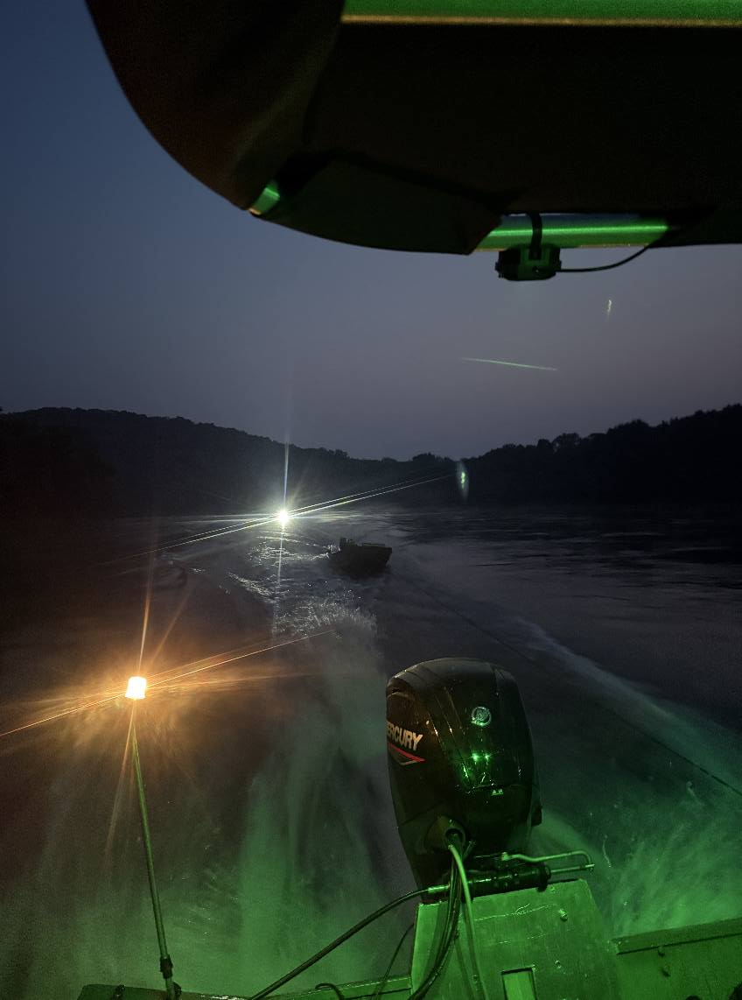
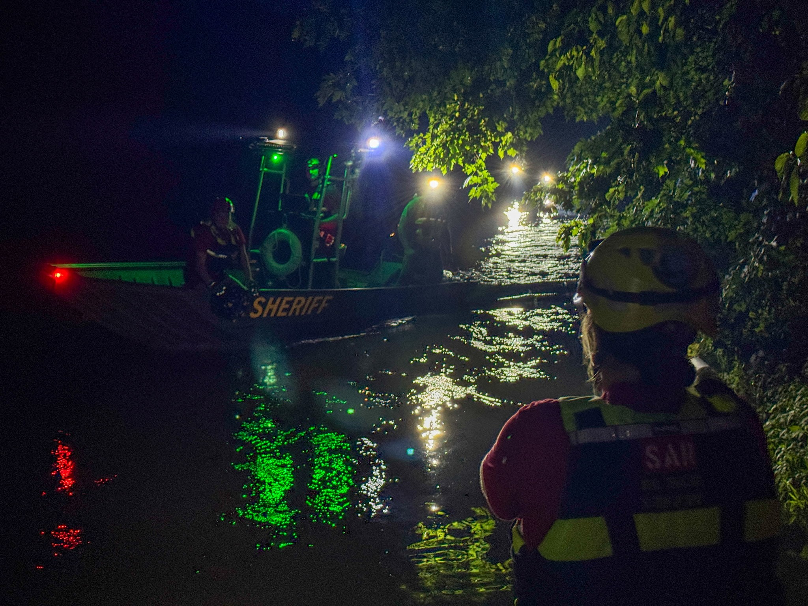

At 2019 hrs, Boone County Search & Rescue was requested to the Highway 30 Boat Ramp to assist the Boone County Sheriff's Office with a water-related incident on the Des Moines River.

A man attempting to retrieve his dog from the water fell from his jon boat. Fortunately, both he and his dog were able to safely reach shore without injury. However, due to the high water level and strong current, the boat was quickly swept downstream.

Sheriff’s Deputies arriving on scene confirmed the individuals were safe and deployed a drone, successfully locating the vessel pinned against the Kate Shelley Bridge abutments.

Boone County SAR responded with 12 members and deployed two rescue boats. At 2041 hrs, our first boat launched. By 2058 hrs, SAR 93—our largest rescue craft—had reached and secured the vessel, initiating a safe return tow back to the ramp. Team members on shore assisted the owner with loading the boat back onto his trailer.

While this incident ended safely, it serves as a reminder: Always wear a life vest when on the water, yourself and your pets included. The Des Moines River is currently running high and deceptively fast. Conditions can change quickly, even for experienced boaters.

We’re thankful for a safe outcome and proud of the teamwork between the Boone County Sheriff’s Office and SAR personnel.
