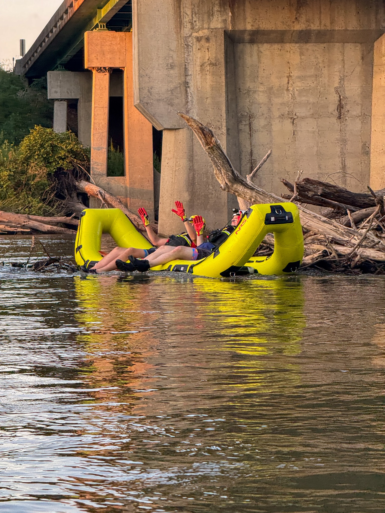
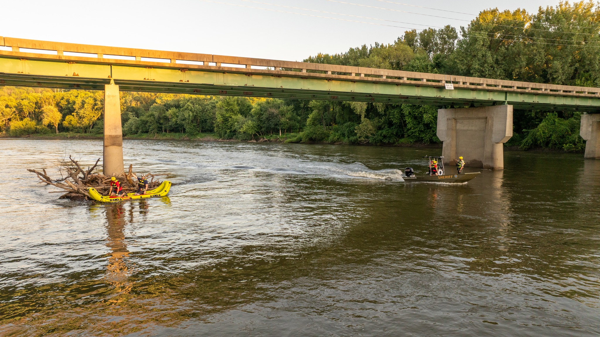
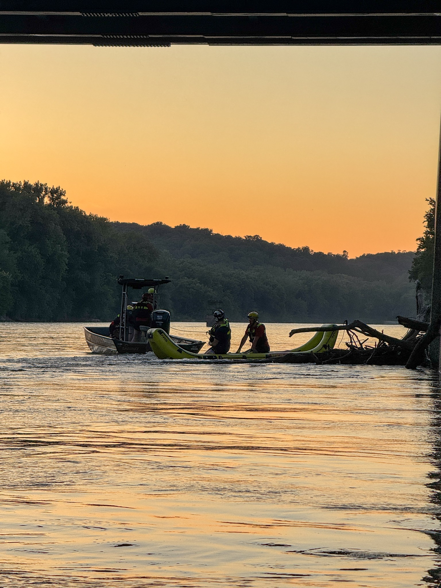
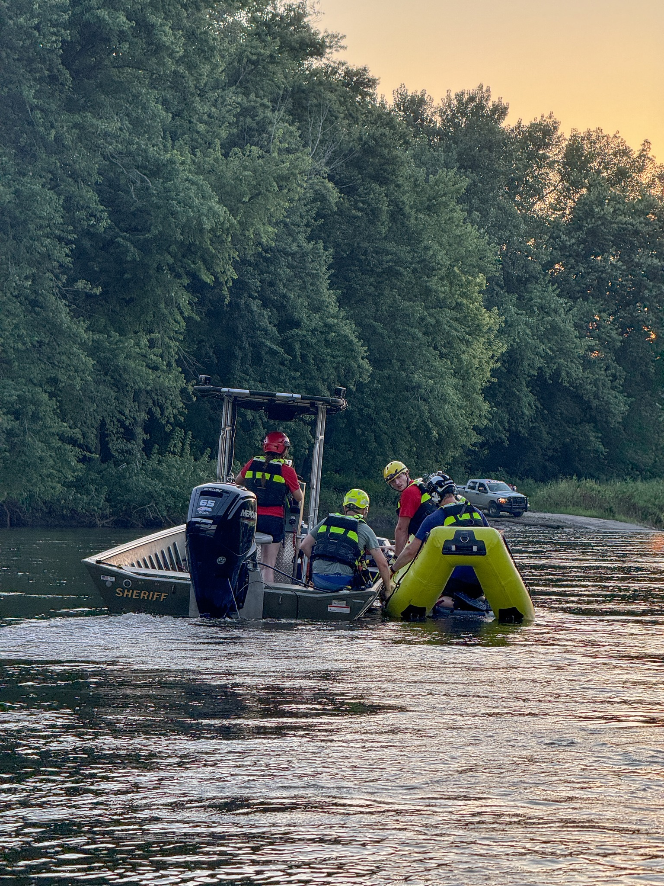

As the saying goes, “the best laid plans…”

We had planned to run watercraft and rescue swimmer training at Don Williams Lake this Tuesday evening. However, with elevated E. coli levels in the water, our team made the decision not to risk unnecessary exposure for our rescuers. (Important note: while levels are elevated, they are not above the state threshold and no advisory has been issued, we simply chose to be cautious when no real emergency was present.)

But our crews don’t waste an opportunity to train. Instead, we moved operations to the Des Moines River at the South Fraser Boat Ramp, where recent high water provided excellent conditions for other critical skill sets.

Here’s what we worked on:

- Boat maneuvering drills in current
- Operating close to hazards like the Kale Road Bridge abutments and a large snag
- Scenarios involving kayakers pinned on a snag (with our inflatable raft and a few willing rescuers standing in as “victims”)
- Low-light operations; because rescues don’t only happen in daylight

Snags and other debris in moving water remain a serious hazard for boaters, kayakers, and tubers. These obstacles can trap and pin watercraft with tremendous force, making self-rescue nearly impossible. Tonight’s training reinforced just how dangerous these situations can be and why our team prepares for them.

We’re proud of our members for staying adaptable and ready, no matter the circumstances. A huge thank you to the community for your continued support!