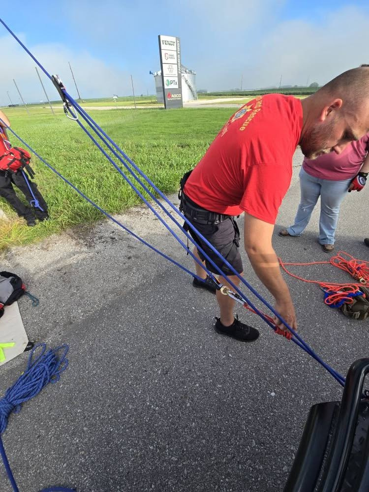
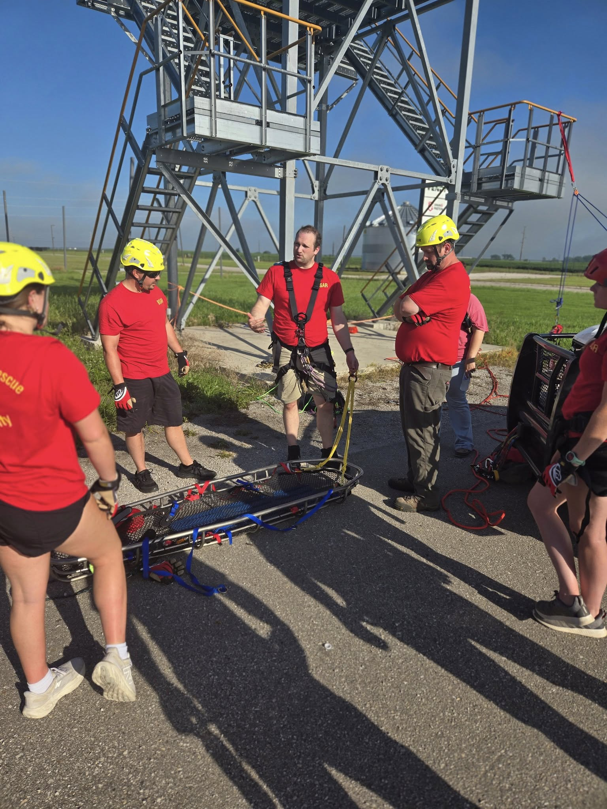

Not every training looks like jumping into rushing water or lowering over a cliff face, but these are the days that make those moments possible.

This morning, Boone County Search & Rescue focused on Operations-level rope rescue skills check-offs, working through essential fundamentals like:

- Knot tying and anchor building
- Belay setup and rope handling
- Haul and lower systems for patient movement

Why does it matter?

Because in rescue work, consistency, safety, and confidence matter most. These check-offs are part of our ongoing effort to ensure every team member stays sharp, capable, and ready to act, no matter the conditions.

A big thank-you to Central Iowa Expo for continuing to support our training efforts by allowing us to use their grounds.
