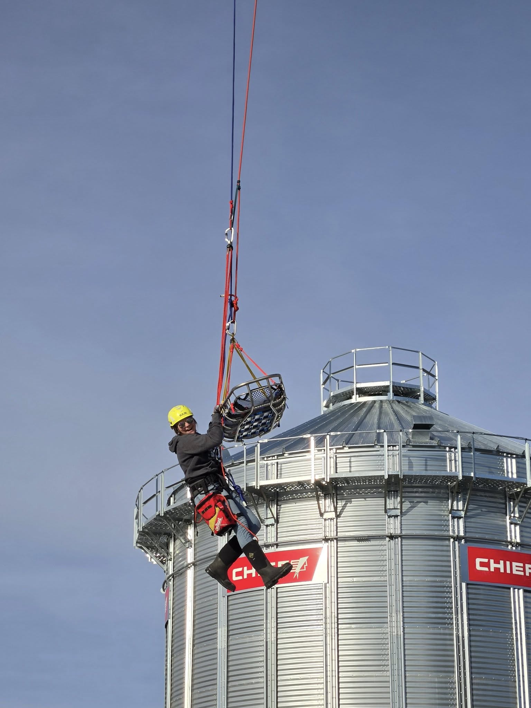
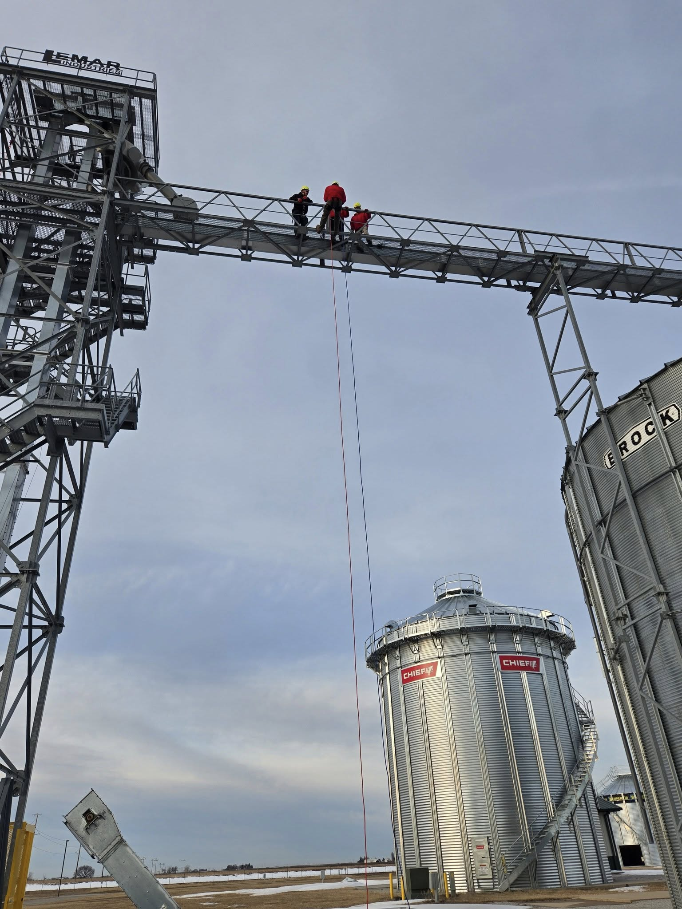

It was a busy weekend for Boone County Search & Rescue! On Saturday, our team responded to a mutual aid callout on the Boone River, and on Sunday, we were back in action for our Monthly Training, focusing on Rope Rescue.

Training included:

- Raises & Lowers with a rescuer and stokes basket
- Rescuer Transitions from below to above the basket
- Haul Team & Rescue Team Operations
- Self-Ascension & Rigging Techniques

And because no training is complete without a little fun, members also took the opportunity to rappel off the 50ft scaffolding!

A huge thank you to Central Iowa Expo for allowing us to train among their grain bins, gantries, and structures. Access to these environments helps us refine our skills for real-world rescues.

Despite a demanding weekend, our members showed up, trained hard, and reinforced their commitment to keeping our community safe. We’re grateful for their dedication and teamwork!
