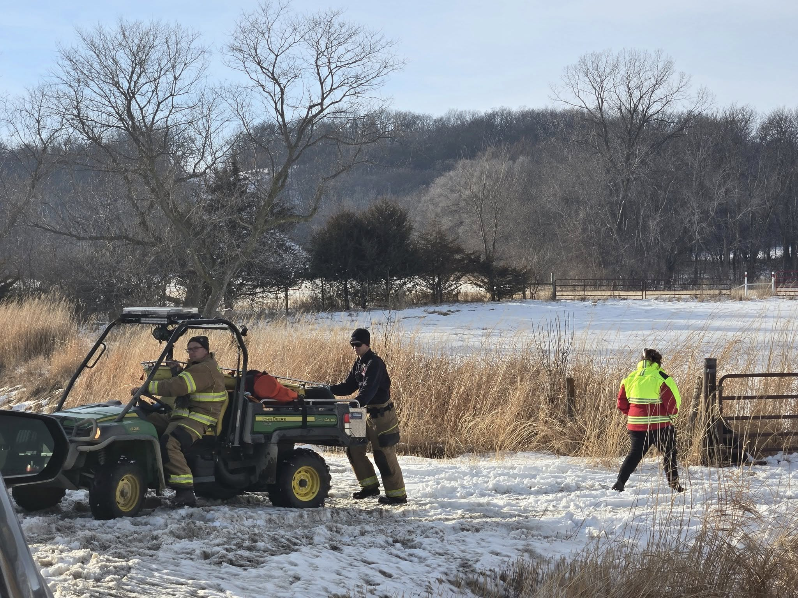

Yesterday at 1517 hrs, Boone County Search & Rescue was dispatched north of 130th St. on the Boone River to provide mutual aid to Boone Fire Department and Boone County Ambulance for a snowmobile accident on the river.

Our team assisted in getting the patient off the river and to the road for medical care. Also on scene assisting were members of the Boone County Sheriff's Office.

This incident highlights the importance of mutual aid between agencies in handling technical rescues. Successful outcomes in challenging environments, such as ice and water rescues, require coordinated efforts and specialized skills from multiple response teams working together.

We appreciate the collaboration of all agencies involved and remind everyone to exercise caution when operating vehicles on ice and unpredictable terrain.

Stay safe, Boone County!
