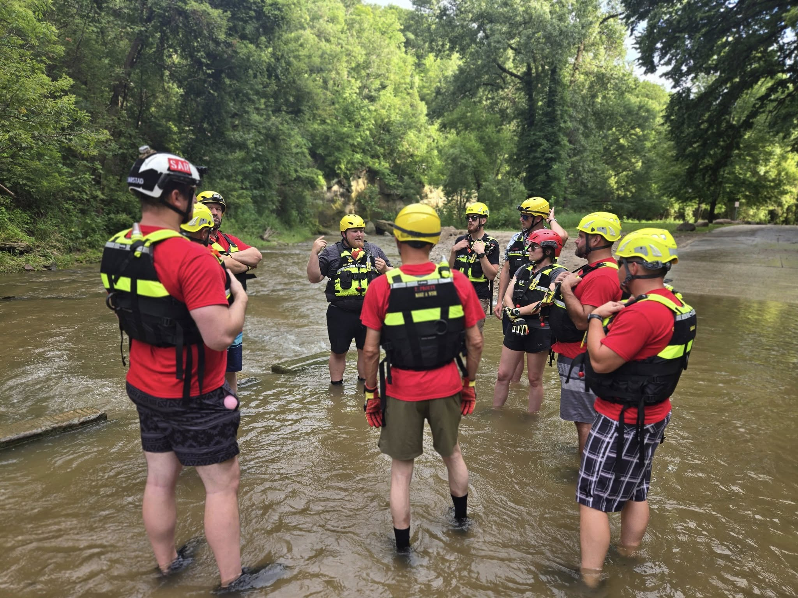

Boone County Search & Rescue spent the evening working on swiftwater wading techniques, focusing on safe and effective methods for crossing thigh-to-waist deep moving water.

Our members practiced:

- One-person, two-person, and team-based crossing formations
- Rope-assisted techniques for supporting rescuers and reaching victims
- Strategies for safely navigating shallow swiftwater environments

While conditions weren’t as deep as we’d hoped, they provided the perfect opportunity to drill the fundamentals and fine-tune coordination before moving into more dynamic water.
