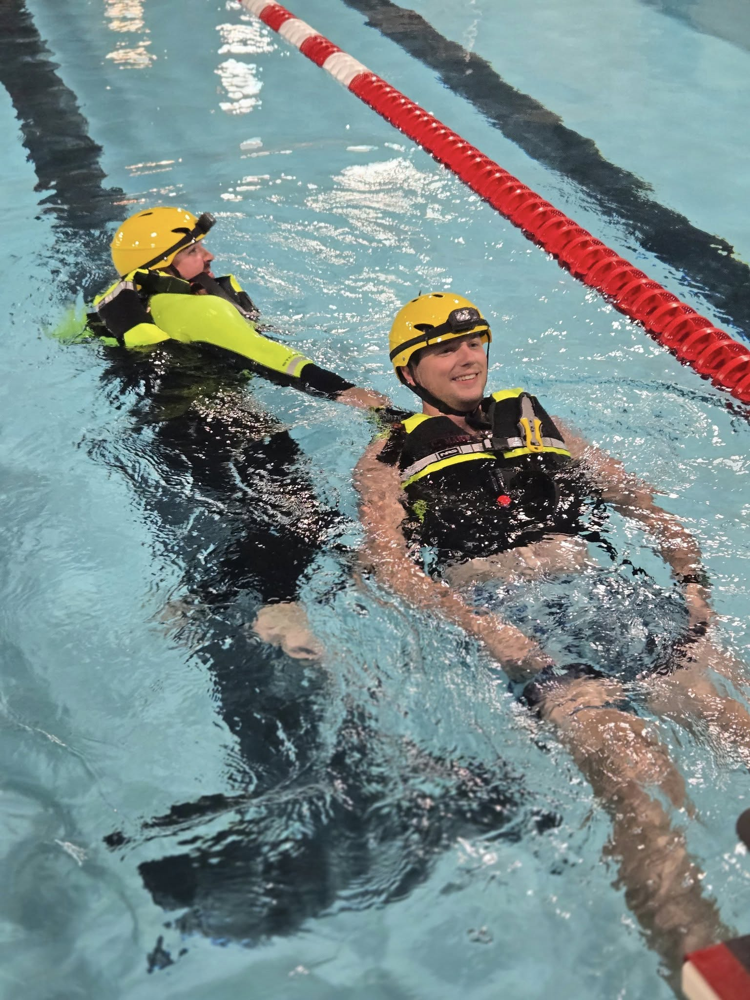

Last night, several of our members took a major step forward in becoming Rescue Swimmers by completing our Rescue Swimmer Competency Test. This rigorous evaluation includes a distance swim, a victim drag, and an extended water tread—all designed to ensure that our team members have the strength, stamina, and skill required to operate in high-risk aquatic environments.

This test is more than just a checkbox, it’s a vital part of our commitment to NFPA-compliant training and operational readiness. Our goal is to ensure that every rescuer who enters the water is confident, capable, and prepared to save lives.

We’re incredibly grateful to the Boone Community School District for allowing us access to their indoor pool. Having a safe, controlled environment like this allows our team to perform and assess these high-level skills with precision and safety.
