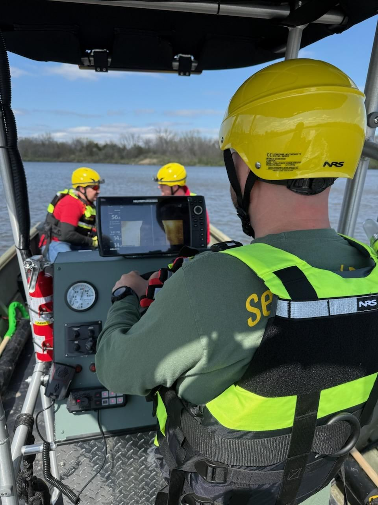
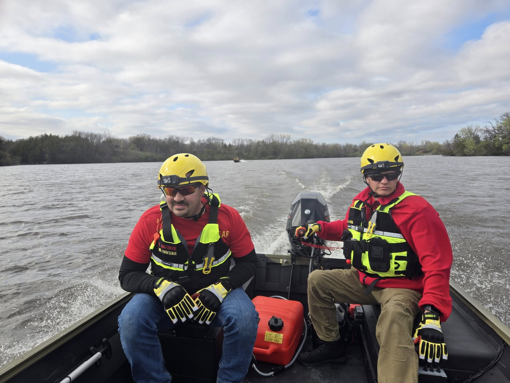
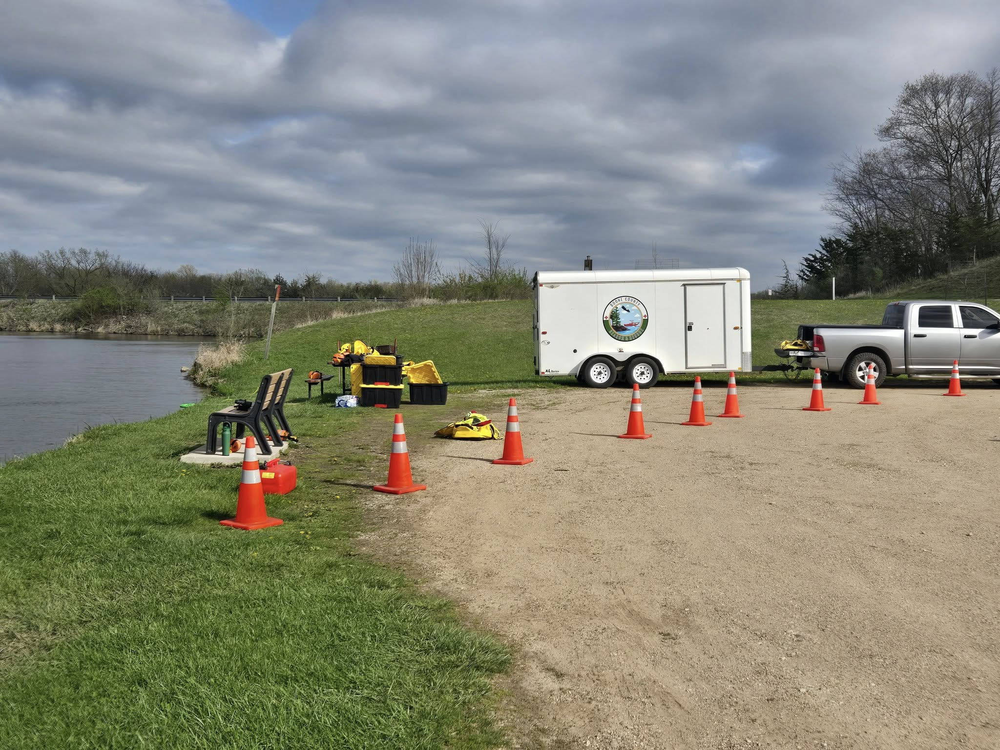

Today, Boone County Search & Rescue members gathered at Don Williams Lake to continue building the skills that keep our community safe.

On shore, teams trained on hazard assessments, operational zone setup, victim information gathering, and throw bag rescues; critical shoreline techniques at both the Awareness and Operations levels.

On the water, members worked through pre-use inspections, PPE checks, boat handling exercises, and launch and recovery operations, progressing through Awareness, Operations, and even Technician-level boat operation skills.

Training days like today are about more than drills; they're about staying ready to serve, working together as a team, and preparing for the moments when our community needs us most.

We would like to extend a sincere thank you to the fishermen and visitors at Don Williams Lake for their patience today. We recognize that our training operations may have disrupted some fishing conditions, and we truly appreciate your understanding as we work to stay prepared for real-world emergencies.

Boone County Search & Rescue — always training, always ready, always here to help.

We strive to balance our training needs with respect for the community spaces we all share.
